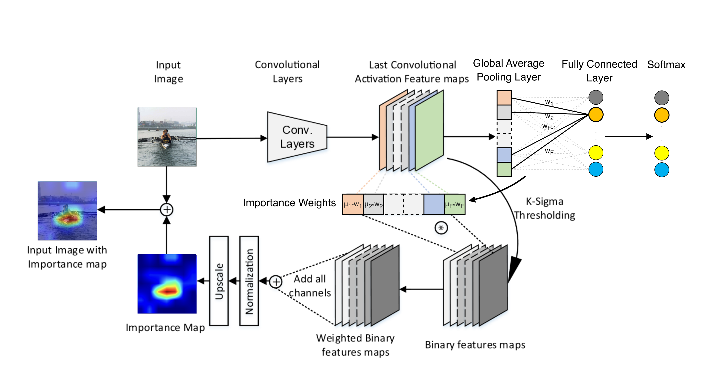
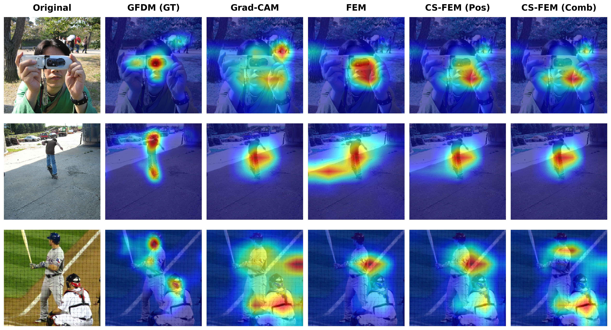

# CS-FEM

Class-Specific Feature Explanation Method (CS-FEM) is a lightweight Python package for visualising CNN decisions with three complementary explainability methods:

- `FEM`: the original Feature Explanation Method, which is class-agnostic.
- `CSFEM`: a class-specific extension of FEM with two weighting modes.
- `GradCAM`: a thin wrapper around [`pytorch-grad-cam`](https://github.com/jacobgil/pytorch-grad-cam) so the outputs can be compared side by side.

This repository accompanies a workshop paper and is intentionally small: the core implementation lives in `csfem/` and the end-to-end demo lives in `examples/demo.ipynb`.

## Visual overview

The figure below shows the CS-FEM pipeline used throughout the paper.



## Qualitative examples

The next figure shows qualitative comparisons taken from the paper.



## What CS-FEM does

FEM builds saliency maps by thresholding each feature channel statistically, weighting the surviving activations, and aggregating them into a heatmap. CS-FEM keeps the same thresholding pipeline, but replaces the class-agnostic channel weighting with class-specific weights so the explanation is targeted to a chosen prediction.

CS-FEM supports two weighting modes:

- `mode="weights"`: uses the classification head weights for the predicted or specified class. This is fast and exact for models with a linear classifier head.
- `mode="gradients"`: uses Grad-CAM-style gradients pooled over the target activations. This works on any CNN and matches `weights` mode for GAP + linear-head architectures.

## Repository layout

- `csfem/`: package implementation.
- `examples/demo.ipynb`: walkthrough notebook with pretrained ResNet-50 and VGG16 examples.
- `images/`: figures used for the paper and documentation.

## Requirements

The library depends on:

- Python 3.9+
- `torch`
- `torchvision`
- `numpy`
- `opencv-python`
- `matplotlib`
- `requests`
- `pillow`
- `grad-cam`

Install them with:

```bash
pip install -r requirements.txt
```

If you need a GPU-enabled PyTorch build, follow the official PyTorch installation instructions for your platform first, then install the remaining packages.

## Quick start

The package is designed to be used directly from the repository.

```python
import sys
sys.path.insert(0, '.')

import torch
import torchvision.models as models
from csfem import FEM, CSFEM, GradCAM
```

### Example with ResNet-50

```python
device = torch.device('cuda' if torch.cuda.is_available() else 'cpu')
model = models.resnet50(weights=models.ResNet50_Weights.IMAGENET1K_V1).to(device).eval()
target_layer = model.layer4[-1]

fem = FEM(model, target_layer)
csfem = CSFEM(model, target_layer, classifier_layer=model.fc, mode='weights')
gradcam = GradCAM(model, target_layer)
```

All three explainers expect a preprocessed input tensor of shape `[1, 3, H, W]`. For ImageNet models, the notebook uses the standard normalization:

```python
preprocess = torchvision.transforms.Compose([
    torchvision.transforms.Resize(256),
    torchvision.transforms.CenterCrop(224),
    torchvision.transforms.ToTensor(),
    torchvision.transforms.Normalize(
        mean=[0.485, 0.456, 0.406],
        std=[0.229, 0.224, 0.225],
    ),
])
```

### Generate heatmaps

```python
saliency_fem = fem(input_tensor)
saliency_csfem_pos = csfem(input_tensor, positive_only=True)
saliency_csfem_comb = csfem(input_tensor, positive_only=False)
saliency_gradcam = gradcam(input_tensor)
```

Use `class_idx=...` if you want to explain a specific class instead of the top prediction.

Remember to release FEM/CS-FEM hooks when you are done:

```python
fem.release()
csfem.release()
```

`GradCAM.release()` is a no-op and is provided only for API consistency.

## Notebook demo

`examples/demo.ipynb` demonstrates the full workflow:

1. Install dependencies.
2. Load a pretrained ImageNet model.
3. Download a sample image.
4. Generate FEM, CS-FEM, and Grad-CAM heatmaps.
5. Visualise and save the output figures.

The notebook also shows how to:

- switch to `mode="gradients"` for architectures without a GAP + linear classifier head,
- use VGG16 as an alternative backbone,
- replace the sample image with a local file,
- target a specific class index manually.

Run it from the repository root so the relative import path in the notebook works as expected.

## API summary

### `FEM(model, target_layer, k=2.0)`

Class-agnostic saliency method based on statistical thresholding.

Methods:

- `fem(input_tensor, positive_only=True)`
- `fem.explain(input_tensor, positive_only=True)`
- `fem.release()`

### `CSFEM(model, target_layer, classifier_layer=None, mode="weights", k=2.0)`

Class-specific FEM variant.

Methods:

- `csfem(input_tensor, class_idx=None, positive_only=True)`
- `csfem.explain(input_tensor, class_idx=None, positive_only=True)`
- `csfem.release()`

### `GradCAM(model, target_layer)`

Wrapper around `pytorch-grad-cam` with the same calling style.

Methods:

- `gradcam(input_tensor, class_idx=None)`
- `gradcam.explain(input_tensor, class_idx=None)`
- `gradcam.release()`

## Notes

- `mode="weights"` requires a linear classifier layer such as `model.fc` in ResNet-50.
- `mode="gradients"` is the safer choice for architectures without a simple linear head.
- The example notebook uses pretrained ImageNet models, but the package itself works with any CNN where you can select an appropriate target layer.
- The returned heatmaps are NumPy arrays in `[0, 1]` and can be overlaid with `pytorch_grad_cam.utils.image.show_cam_on_image`.

## Citation

This repository accompanies the upcoming paper **"CS-FEM: Class-Specific Feature Explanation Method and Its Relation to Grad-CAM."** If you use this code in your research, please cite it as follows (the BibTeX will be updated with conference/journal details once published):

```bibtex
@article{csfem_upcoming,
  title={CS-FEM: Class-Specific Feature Explanation Method and Its Relation to Grad-CAM},
  author={Ün, Ahmet Furkan and Le, Dinh Nam and Benois-Pineau, Jenny and Escudero-Viñolo, Marcos},
  year={2026},
  note={In preparation}
}
```

## References

This package builds upon and compares against the following foundational explainability methods. If you use CS-FEM, please consider citing them as well:

**FEM (Feature Explanation Method)**
```bibtex
@inproceedings{fuad2020features,
  title={Features understanding in 3d cnns for actions recognition in video},
  author={Fuad, Kazi Ahmed Asif and Martin, Pierre-Etienne and Giot, Romain and Bourqui, Romain and Benois-Pineau, Jenny and Zemmari, Akka},
  booktitle={2020 Tenth International Conference on Image Processing Theory, Tools and Applications (IPTA)},
  pages={1--6},
  year={2020},
  organization={IEEE}
}
```
**Grad-CAM (Gradient-weighted Class Activation Mapping)**
```bibtex
@inproceedings{selvaraju2017grad,
  title={Grad-cam: Visual explanations from deep networks via gradient-based localization},
  author={Selvaraju, Ramprasaath R and Cogswell, Michael and Das, Abhishek and Vedantam, Ramakrishna and Parikh, Devi and Batra, Dhruv},
  booktitle={Proceedings of the IEEE international conference on computer vision},
  pages={618--626},
  year={2017}
}
```
